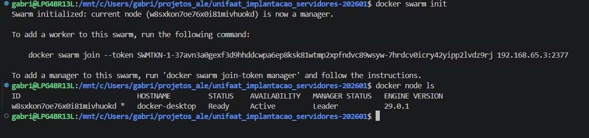
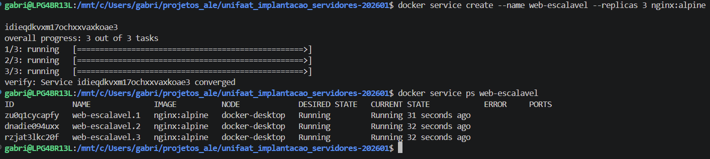
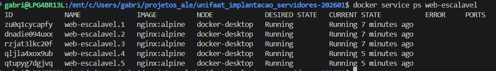
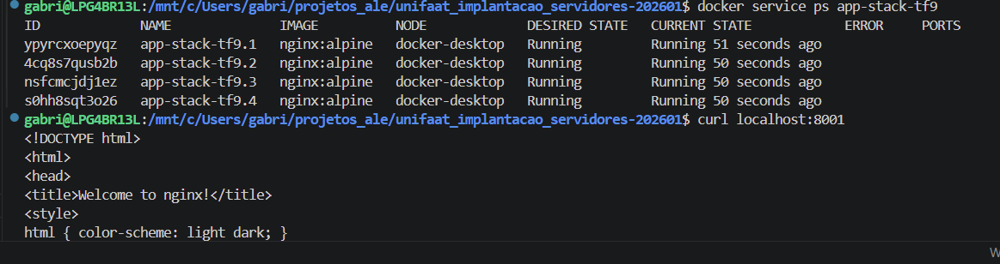
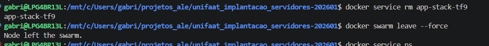

# Tarefa Final - Aula 008: Docker Swarm
## RA: 6325149

---

## Respostas Teóricas

### Questão 1: Conceito de Cluster (Teórica)

**Pergunta:** Qual é a diferença fundamental entre um ambiente Docker rodando com **Docker Compose** (que gerencia o *Stack* em um único Host) e um ambiente orquestrado com **Docker Swarm** (que gerencia o *Stack* em um *Cluster*)?

**Resposta:**

Docker Compose gerencia múltiplos containers em uma única máquina, sendo ideal para desenvolvimento e ambientes locais. Ele orquestra serviços em um host único através de um arquivo `docker-compose.yml`.

Docker Swarm orquestra containers em um cluster (múltiplos hosts), permitindo escalabilidade, distribuição de carga, alta disponibilidade e recuperação automática de falhas. O Swarm é pensado para ambientes de produção onde a aplicação precisa rodar em múltiplas máquinas.

**Resumo:** Compose = single host; Swarm = cluster distribuído.

---

### Questão 2: Funções dos Nós (Teórica)

**Pergunta:** Dentro de um *Cluster* Swarm, existem dois papéis principais: **Manager** e **Worker**. Explique brevemente as responsabilidades de cada um desses papéis.

**Resposta:**

**Manager:**
- Controla e gerencia o estado do cluster
- Toma decisões sobre onde os serviços vão rodar
- Gerencia escalabilidade e recuperação de falhas
- Mantém o consenso do cluster (algoritmo Raft)
- Expõe a API do Swarm

**Worker:**
- Executa os containers conforme direcionado pelo manager
- Recebe tarefas (tasks) do manager
- Reporta o status da execução

**Frase-chave:** Manager decide; Worker executa.

---

### Questão 3b: Driver de Rede (Teórica)

**Pergunta:** Qual é o **Driver de Rede** que o Swarm utiliza por padrão para a comunicação entre *Services* em diferentes Hosts (Nós)?

**Resposta:**

**Overlay**

O driver overlay permite a comunicação entre serviços distribuídos em diferentes nós do cluster, funcionando como uma rede virtual que conecta os containers através dos hosts participantes.

---

### Questão 5b: Capacidade de Recuperação (Teórica)

**Pergunta:** Se um dos nós do *Cluster* falhar, o Swarm tentará realocar automaticamente as instâncias perdidas para outros nós saudáveis. Qual termo descreve essa capacidade do Swarm?

**Resposta:**

**Auto-healing** (ou autorrecuperação)

Essa capacidade permite que o Swarm detecte automaticamente quando o estado atual diverge do estado desejado e tome ações para restaurar a conformidade. Se uma réplica falha, o Swarm cria outra para manter o número de instâncias ativo conforme declarado.

---

## Questões Práticas

### Questão 3a: Inicialização do Swarm

**Pergunta:** Qual comando você deve executar para **inicializar um novo Cluster Swarm**?

**Resposta:**

```bash
docker swarm init
```

---

### Questão 4a: Criação de Service com Réplicas

**Pergunta:** Qual comando você deve usar para criar um novo *Service* chamado **`web-escalavel`**, utilizando a imagem `nginx:alpine`, e **escalando**-o para ter 3 réplicas?

**Resposta:**

```bash
docker service create --name web-escalavel --replicas 3 nginx:alpine
```

---

### Questão 4b: Visualizar Status das Réplicas

**Pergunta:** Qual comando você deve usar para **visualizar o *status* em tempo real** das 3 réplicas do *Service*?

**Resposta:**

```bash
docker service ps web-escalavel
```

---

### Questão 5a: Aumentar Escala

**Pergunta:** Qual comando você deve usar para **aumentar** a contagem de réplicas do *Service* `web-escalavel` de 3 para **5**?

**Resposta:**

```bash
docker service scale web-escalavel=5
```

---

## Tarefa Prática Integrada

### Passo 1: Inicialização do Cluster

**Limpeza (se necessário):**
```bash
docker swarm leave --force
```

**Inicialização:**
```bash
docker swarm init
```

**Verificação do nó Manager:**
```bash
docker node ls
```

**Evidência 1 - Inicialização e Verificação do Manager:**



---

### Passo 2: Deploy de um Serviço

**Comando para criar o service:**
```bash
docker service create \
  --name app-stack-tf9 \
  --replicas 4 \
  -p 8001:80 \
  nginx:alpine
```

**Verificação das réplicas:**
```bash
docker service ps app-stack-tf9
```

**Evidência 2 - Service Criado com Réplicas:**



---

### Passo 3: Validação e Evidências

**Verificação do Status das 4 Réplicas:**
```bash
docker service ps app-stack-tf9
```

**Acesso Externo:**
```bash
curl localhost:8001
```

**Evidência 4 - Status das Réplicas e Acesso Externo:**



---

### Passo 4: Escalabilidade (Redução)

**Comando para reduzir de 4 para 1 réplica:**
```bash
docker service scale app-stack-tf9=1
```

**Evidência 5 - Escalabilidade em Ação (Redução):**



---

### Passo 5: Limpeza Final

**Remover o Service:**
```bash
docker service rm app-stack-tf9
```

**Sair do Swarm:**
```bash
docker swarm leave --force
```

**Verificação final:**
```bash
docker info | grep Swarm
```

**Evidência 6 - Limpeza Final:**



---

## Resumo de Conceitos Cobrados

| Conceito | Definição |
|----------|-----------|
| **Cluster** | Conjunto de máquinas trabalhando como um ambiente único |
| **Manager** | Nó que controla e coordena o cluster |
| **Worker** | Nó que executa as tarefas |
| **Service** | Definição de como a aplicação deve rodar |
| **Réplica** | Cópia de uma instância do service |
| **Auto-healing** | Recuperação automática de falhas |
| **Overlay** | Rede para comunicação entre nós |
| **Load Balancing** | Distribuição automática de tráfego |

---

**Data:** 27 de abril de 2026  
**Disciplina:** Implementação de Servidor e Nuvem (Cloud)  
**Aula:** 008 - Introdução à Orquestração (Docker Swarm)
