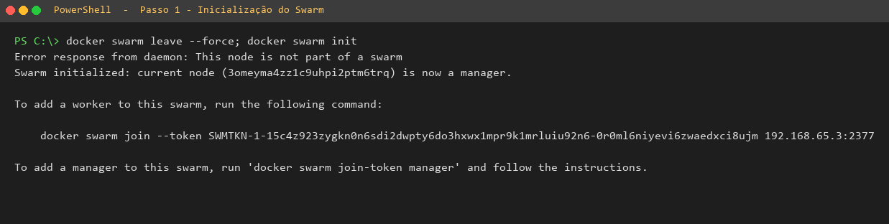
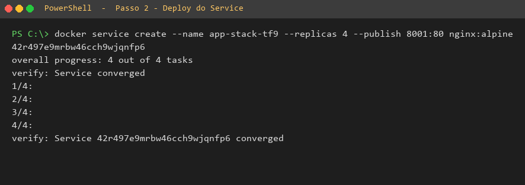
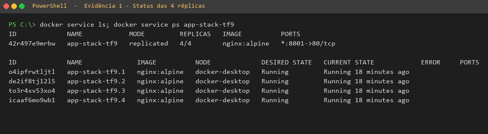
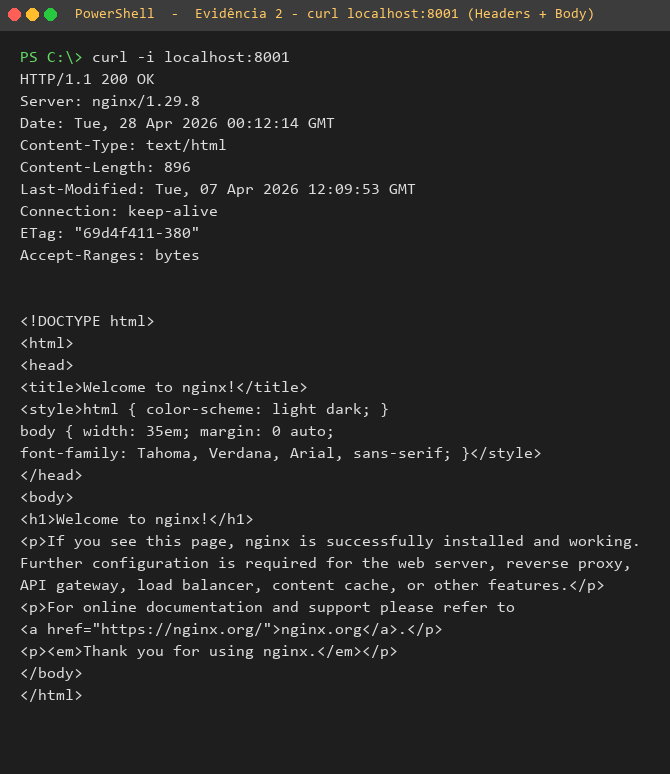
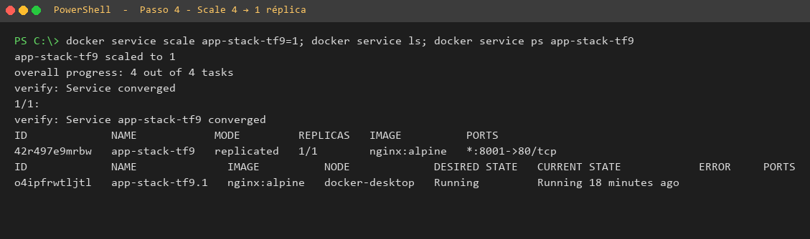
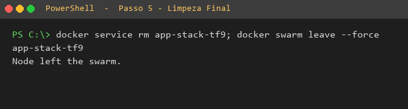

# TF008 — Docker Swarm

**Aluno:** José Henrique Teixeira Luiz
**RA:** 3225002
**Disciplina:** Implementação de servidor e nuvem (cloud)
**Aula:** 8 — Introdução à Orquestração (Docker Swarm)

---

## Questões Teóricas

### Questão 1: Conceito de Cluster

A diferença fundamental entre Docker Compose e Docker Swarm está no **escopo de execução**:

- **Docker Compose** gerencia múltiplos containers (um *Stack*) rodando em um **único host**. É voltado para desenvolvimento local e ambientes simples, onde todos os serviços convivem na mesma máquina.
- **Docker Swarm** gerencia o *Stack* distribuído em um **cluster de múltiplos hosts** (vários nós conectados). É voltado para produção, oferecendo alta disponibilidade, balanceamento de carga e tolerância a falhas — se um host cai, o Swarm redireciona os containers para outros nós saudáveis.

Em resumo: Compose = 1 máquina; Swarm = várias máquinas trabalhando como uma só.

---

### Questão 2: Funções dos Nós

- **Manager:** É o nó responsável pelo **controle e orquestração** do cluster. Mantém o estado desejado, agenda os *services*, distribui as tarefas para os workers, expõe a API do Swarm e toma todas as decisões administrativas.
- **Worker:** É o nó **executor**. Recebe as tarefas (tasks) atribuídas pelos Managers e executa os containers correspondentes. Não toma decisões de orquestração — apenas roda o que o Manager mandou.

Observação: um Manager também pode atuar como Worker (executar tasks), mas um Worker puro não pode gerenciar.

---

### Questão 3: Inicialização do Swarm

**a) Comando para inicializar um novo Cluster Swarm:**

```bash
docker swarm init
```

**b) Driver de Rede padrão para comunicação entre Services em diferentes Hosts:**

**Overlay** — É uma rede virtual que abstrai a comunicação entre containers em hosts diferentes do cluster, fazendo parecer que estão na mesma rede local.

---

### Questão 4: Criação de Service

**a) Comando para criar o service `web-escalavel` com 3 réplicas:**

```bash
docker service create --name web-escalavel --replicas 3 nginx:alpine
```

**b) Comando para visualizar o status em tempo real das 3 réplicas:**

```bash
docker service ps web-escalavel
```

---

### Questão 5: Atualização e Escalabilidade

**a) Comando para aumentar de 3 para 5 réplicas:**

```bash
docker service scale web-escalavel=5
```

**b) Termo que descreve a capacidade de realocar instâncias automaticamente quando um nó falha:**

**Self-healing** (auto-recuperação), também chamado de **reconciliação de estado**. O Swarm mantém continuamente o estado real igual ao estado desejado: se foram pedidas 5 réplicas e uma delas some por causa de um nó caído, o Swarm cria automaticamente outra réplica em um nó saudável.

---

## Tarefa Prática Integrada

> Todos os comandos abaixo foram executados em um ambiente Docker Desktop (Windows + WSL2), simulando um cluster de nó único. Cada print mostra o comando e sua respectiva saída.

### Passo 1 — Inicialização do Cluster

**Comandos executados:**

```bash
docker swarm leave --force
docker swarm init
```

**Print da execução:**



> Observação: o comando `docker swarm leave --force` retornou erro porque ainda não havia swarm ativo — comportamento esperado em um ambiente limpo. Em seguida, o `docker swarm init` inicializou o cluster com sucesso, transformando este host no nó **Manager**.

---

### Passo 2 — Deploy do Serviço

**Comando executado:**

```bash
docker service create --name app-stack-tf9 --replicas 4 --publish 8001:80 nginx:alpine
```

**Print da execução:**



> O service convergiu com sucesso (`Service converged`), confirmando que as 4 réplicas foram criadas e estão estáveis.

---

### Passo 3 — Validação e Evidências

#### Evidência 1 — Status das 4 réplicas

**Comandos executados:**

```bash
docker service ls
docker service ps app-stack-tf9
```

**Print da execução:**



✅ As 4 réplicas estão `Running` no node `docker-desktop`, e o service está com `4/4` réplicas ativas, mapeando a porta `8001` do host para a porta `80` do container.

---

#### Evidência 2 — Acesso externo via curl

**Comando executado:**

```bash
curl -i localhost:8001
```

**Print da execução:**



✅ A aplicação respondeu com **HTTP 200 OK** servindo a página padrão do nginx (`Welcome to nginx!`), comprovando que o service está funcional e acessível externamente.

---

### Passo 4 — Escalabilidade (reduzir de 4 para 1)

**Comando executado:**

```bash
docker service scale app-stack-tf9=1
```

**Print da execução:**



✅ O service foi reduzido para `1/1` réplica com sucesso. O Swarm removeu 3 das 4 réplicas, mantendo apenas uma ativa.

---

### Passo 5 — Limpeza Final

**Comandos executados:**

```bash
docker service rm app-stack-tf9
docker swarm leave --force
```

**Print da execução:**



✅ Service removido (`app-stack-tf9`) e nó saiu do swarm (`Node left the swarm.`). Ambiente totalmente limpo.
