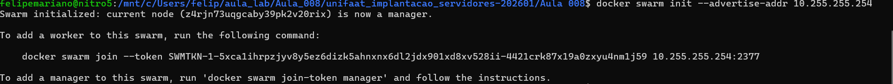
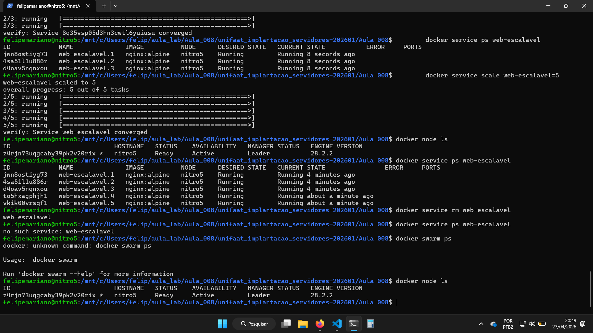
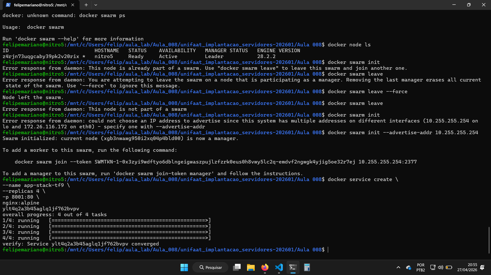
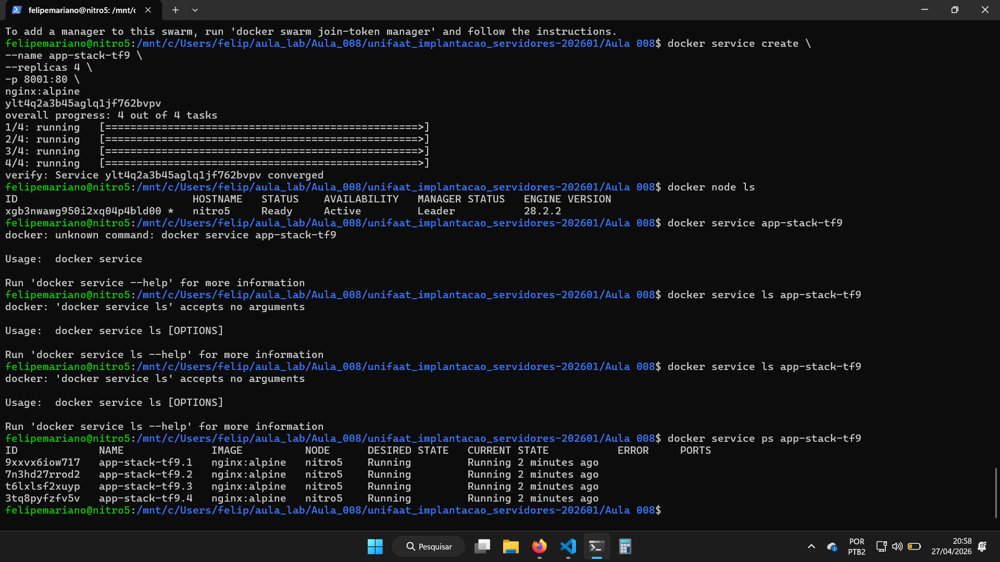
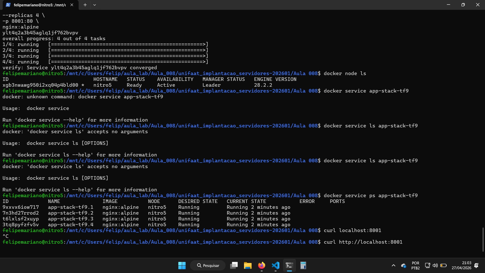
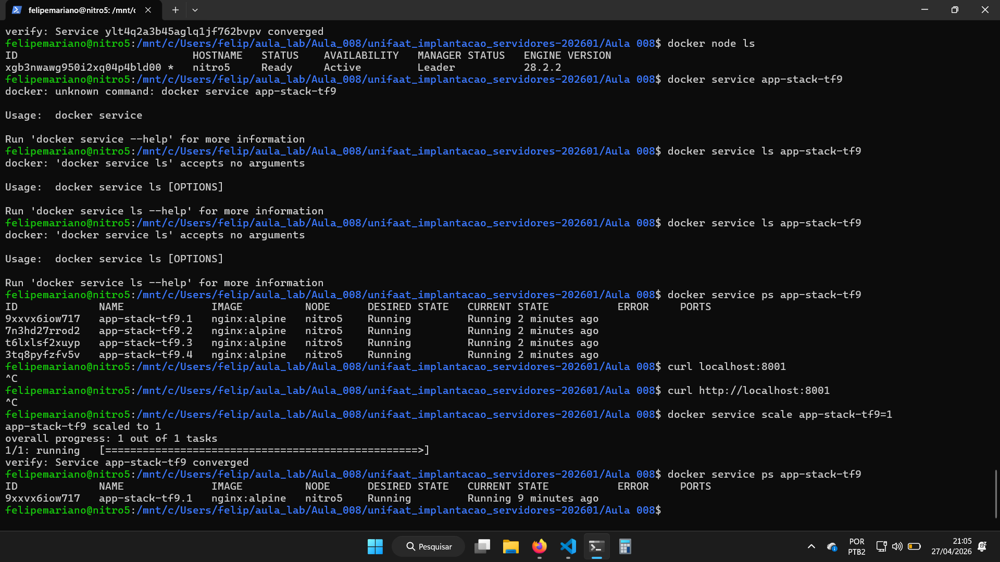
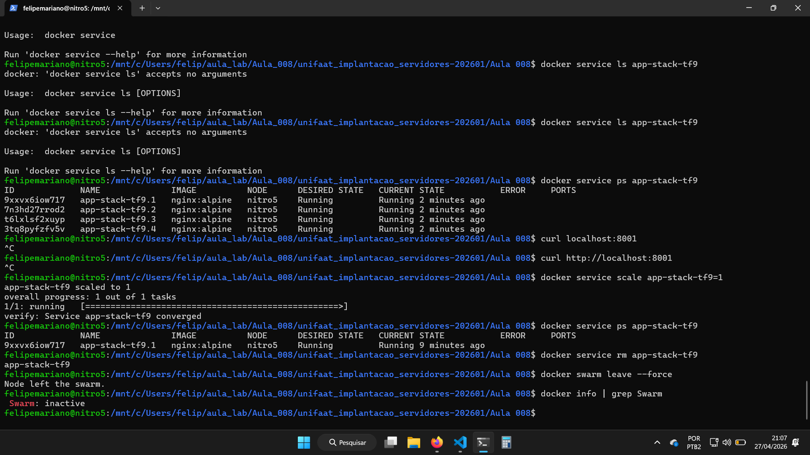

Questão 01:
    Docker compose gerencia de forma mais simplória containers em um único host, enquanto o Docker Swarm gerencia containers em múltiplos hosts.
    Na prática, o Docker Swarm parece ideal para hospedar serviços, onde caso uma máquina caia, uma nova máquina sobe de forma automática logo após.

Questão 02:
    Manager gerencia (orquestra) as diversas máquinas dentro de um cluster, atua como um maestro.
    Worker se trata de cada máquina (cada nó) operando.

Questão 03:
    No meu caso, rodando uma máquina linux via wsl:
    'docker swarm init --advertise-addr <IP-DO-SEU-HOST>'
    

    O Swarm utiliza por padrão o overlay como driver de rede.

Questão 04:
    Comando para criar o cluster:
        docker service create \
        --name web-escalavel \
        --replicas 3 \
        -p 8005:80 \
        nginx:alpine

    Comando para monitorar o cluster:
        docker service ps web-escalavel

Questão 05:
    Comando para aumentar de 3 para 5 o número de réplicas:
        docker service scale web-escalavel=5

    O termo que descreve essa capacidade do Swarm é Auto-reparo ou Self-Healing, onde imediatamente, quando um dos containers caem, outro sobre substituindo-o.

Questão Prática:

    Evidências:
        Passo 01:
            
            

        Passo 02:
            

        Passo 03:
            
             --> // Não consegui realizar o acesso via navegador ou curl.

        Passo 04:
            

        Passo 05:
            

