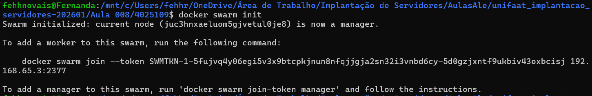
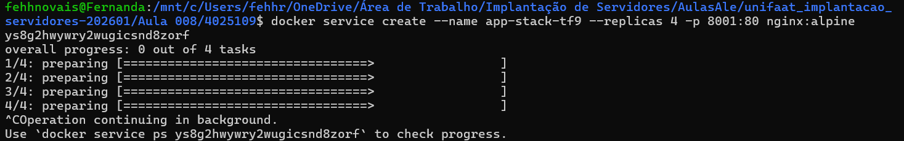
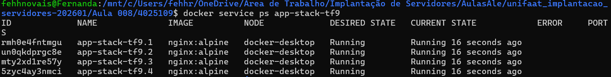
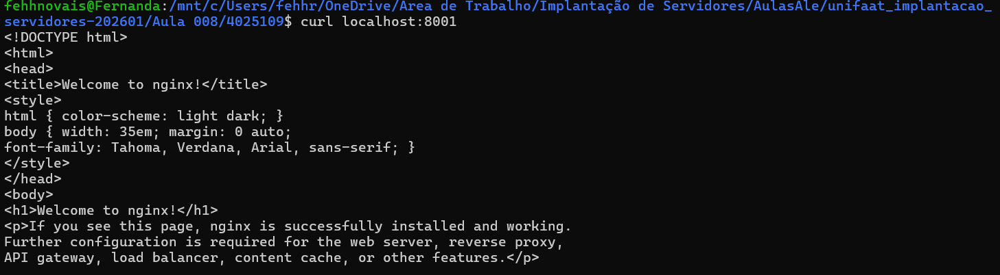
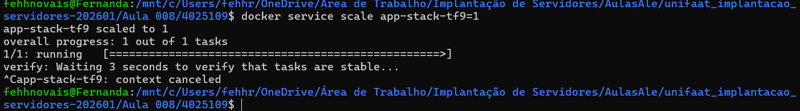
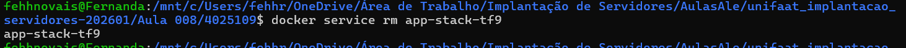
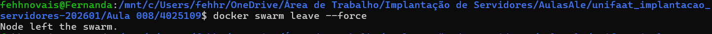

## Questão 1

A diferença é:

Docker Compose: roda tudo em uma máquina só
Docker Swarm: roda em várias máquinas (cluster)

Ou seja, o Swarm é mais avançado porque distribui os containers.

___________________________________________

## Questão 2
Manager: manda e organiza tudo
Worker: só executa o que o Manager manda

___________________________________________

## Questão 3

a) Comando:

docker swarm init

b) Driver de rede:

overlay
___________________________________________

## Questão 4

a) Comando para criar o service com 3 réplicas:

docker service create --name web-escalavel --replicas 3 nginx:alpine

b) Comando para ver o status das réplicas:

docker service ps web-escalavel

___________________________________________

## Questão 5

a) Comando para aumentar de 3 para 5 réplicas:

docker service scale web-escalavel=5

b) Isso se chama:

Alta disponibilidade (High Availability)

___________________________________________

## Passo 1: Inicializar o Swarm

## Passo 2: Criar o Service

## Passo 3: Verificar (Evidência 1)

## Passo 3.2: Testar acesso (Evidência 2)

## Passo 4: Diminuir réplicas

## Passo 5: Limpeza

## Sair do swarm:

O Docker Swarm demonstrou a capacidade de escalar serviços e manter o controle das réplicas automaticamente.
