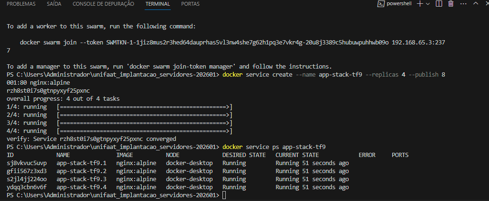
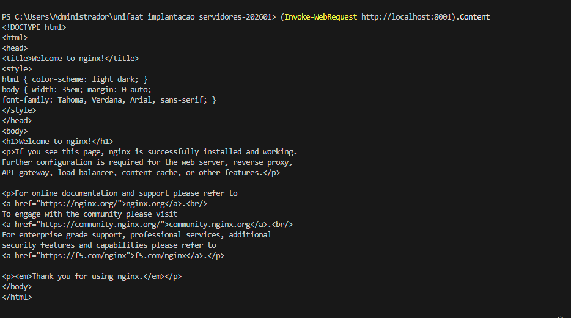
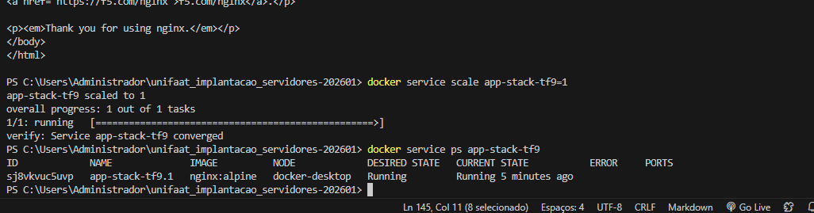

TF Aula 008 - Docker Swarm

Aluno: Rafael Maruca  
RA: 6322006

Questão 1: Conceito de Cluster
A diferença fundamental é que o Docker Compose gerencia containers em um único host, ou seja, todos os serviços rodam em apenas uma máquina. Já o Docker Swarm gerencia serviços em um cluster, formado por várias máquinas conectadas, distribuindo containers entre os nós e permitindo alta disponibilidade, balanceamento de carga e escalabilidade. Docker Compose Docker Swarm

Questão 2: Funções dos Nós
No cluster Swarm, o nó Manager é responsável por administrar o cluster, controlar o estado dos serviços, agendar tarefas e tomar decisões de orquestração. O nó Worker executa os containers e tarefas enviadas pelo Manager, fornecendo capacidade de processamento ao cluster. Docker Swarm

Questão 3: Inicialização do Swarm
a) Prática: Para inicializar um novo Cluster Swarm no Host Docker, execute:
docker swarm init
b) Teórica: O driver de rede utilizado por padrão para comunicação entre Services em diferentes nós é a rede Overlay. Docker Swarm

Questão 4: Criação de Service
a) Prática: Para criar o Service chamado web-escalavel, usando a imagem nginx:alpine com 3 réplicas:
docker service create --name web-escalavel --replicas 3 nginx:alpine
NGINX
b) Prática: Para visualizar em tempo real o status das 3 réplicas:
docker service ps web-escalavel

Questão 5: Atualização e Escalabilidade
a) Prática: Para aumentar de 3 para 5 réplicas:
docker service scale web-escalavel=5
b) Teórica: Essa capacidade do Swarm de realocar automaticamente instâncias para nós saudáveis é chamada de Alta Disponibilidade (High Availability) ou Auto Healing. Docker Swarm

PS C:\Users\Administrador\unifaat_implantacao_servidores-202601> curl http://localhost:8001

StatusCode        : 200
StatusDescription : OK
Content           : <!DOCTYPE html>
                    <html>
                    <head>
                    <title>Welcome to nginx!</title>
                    <style>
                    html { color-scheme: light dark; }
                    body { width: 35em; margin: 0 auto;
                    font-family: Tahoma, Verdana, Arial, sans-serif; }
                    </style...
RawContent        : HTTP/1.1 200 OK
                    Connection: keep-alive
                    Content-Length: 896
                    Content-Type: text/html
                    Date: Tue, 28 Apr 2026 00:30:12 GMT
                    ETag: "69d4f411-380"
                    Last-Modified: Tue, 07 Apr 2026 ...
Forms             : {}
Headers           : {[Connection, keep-alive], [Accept-Ranges, bytes], [Content-Length, 896], [Content-Type, text/html]...}
Images            : {}
InputFields       : {}
Links             : {@{innerHTML=nginx.org; innerText=nginx.org; outerHTML=<A href="https://nginx.org/">nginx.org</A>; outerText=nginx.org;      
                    tagName=A; href=https://nginx.org/}, @{innerHTML=community.nginx.org; innerText=community.nginx.org; outerHTML=<A
                    href="https://community.nginx.org/">community.nginx.org</A>; outerText=community.nginx.org; tagName=A;
                    href=https://community.nginx.org/}, @{innerHTML=f5.com/nginx; innerText=f5.com/nginx; outerHTML=<A
                    href="https://f5.com/nginx">f5.com/nginx</A>; outerText=f5.com/nginx; tagName=A; href=https://f5.com/nginx}}
ParsedHtml        : mshtml.HTMLDocumentClass
RawContentLength  : 896

PS C:\Users\Administrador\unifaat_implantacao_servidores-202601> Invoke-WebRequest http://localhost:8001

StatusCode        : 200
StatusDescription : OK
Content           : <!DOCTYPE html>
                    <html>
                    <head>
                    <title>Welcome to nginx!</title>
                    <style>
                    html { color-scheme: light dark; }
                    body { width: 35em; margin: 0 auto;
                    font-family: Tahoma, Verdana, Arial, sans-serif; }
                    </style...
RawContent        : HTTP/1.1 200 OK
                    Connection: keep-alive
                    Accept-Ranges: bytes
                    Content-Length: 896
                    Content-Type: text/html
                    Date: Tue, 28 Apr 2026 00:30:21 GMT
                    ETag: "69d4f411-380"
                    Last-Modified: Tue, 07 Apr 2026 ...
Forms             : {}
Headers           : {[Connection, keep-alive], [Accept-Ranges, bytes], [Content-Length, 896], [Content-Type, text/html]...}
Images            : {}
InputFields       : {}
Links             : {@{innerHTML=nginx.org; innerText=nginx.org; outerHTML=<A href="https://nginx.org/">nginx.org</A>; outerText=nginx.org;      
                    tagName=A; href=https://nginx.org/}, @{innerHTML=community.nginx.org; innerText=community.nginx.org; outerHTML=<A
                    href="https://community.nginx.org/">community.nginx.org</A>; outerText=community.nginx.org; tagName=A;
                    href=https://community.nginx.org/}, @{innerHTML=f5.com/nginx; innerText=f5.com/nginx; outerHTML=<A
                    href="https://f5.com/nginx">f5.com/nginx</A>; outerText=f5.com/nginx; tagName=A; href=https://f5.com/nginx}}
ParsedHtml        : mshtml.HTMLDocumentClass
RawContentLength  : 896

PS C:\Users\Administrador\unifaat_implantacao_servidores-202601>

PS C:\Users\Administrador\unifaat_implantacao_servidores-202601> Invoke-WebRequest http://localhost:8001

StatusCode        : 200
StatusDescription : OK
Content           : <!DOCTYPE html>
                    <html>
                    <head>
                    <title>Welcome to nginx!</title>
                    <style>
                    html { color-scheme: light dark; }
                    body { width: 35em; margin: 0 auto;
                    font-family: Tahoma, Verdana, Arial, sans-serif; }
                    </style...
RawContent        : HTTP/1.1 200 OK
                    Connection: keep-alive
                    Accept-Ranges: bytes
                    Content-Length: 896
                    Content-Type: text/html
                    Date: Tue, 28 Apr 2026 00:30:59 GMT
                    ETag: "69d4f411-380"
                    Last-Modified: Tue, 07 Apr 2026 ...
Forms             : {}
Headers           : {[Connection, keep-alive], [Accept-Ranges, bytes], [Content-Length, 896], [Content-Type, text/html]...}
Images            : {}
InputFields       : {}
Links             : {@{innerHTML=nginx.org; innerText=nginx.org; outerHTML=<A href="https://nginx.org/">nginx.org</A>; outerText=nginx.org;      
                    tagName=A; href=https://nginx.org/}, @{innerHTML=community.nginx.org; innerText=community.nginx.org; outerHTML=<A
                    href="https://community.nginx.org/">community.nginx.org</A>; outerText=community.nginx.org; tagName=A;
                    href=https://community.nginx.org/}, @{innerHTML=f5.com/nginx; innerText=f5.com/nginx; outerHTML=<A
                    href="https://f5.com/nginx">f5.com/nginx</A>; outerText=f5.com/nginx; tagName=A; href=https://f5.com/nginx}}
ParsedHtml        : mshtml.HTMLDocumentClass
RawContentLength  : 896

PS C:\Users\Administrador\unifaat_implantacao_servidores-202601>

