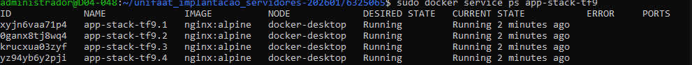
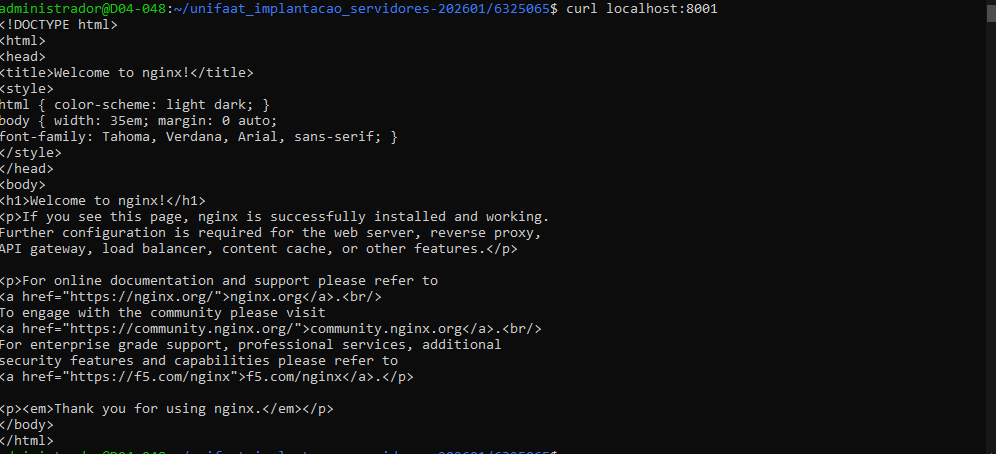

# Tarefa Final - Aula 8 — Docker Swarm

**RA:** 6325065
**Nome:** Matheus Maciel de Paula

---

## Questão 1 — Conceito de Cluster

O **Docker Compose** gerencia containers em um **único Host**, sem tolerância a falhas entre máquinas e sem distribuição de carga entre nós. O **Docker Swarm** gerencia um **Cluster** de múltiplos Hosts (nós), distribuindo os containers entre eles, oferecendo alta disponibilidade, balanceamento de carga automático e recuperação em caso de falha de um nó.

---

## Questão 2 — Funções dos Nós

- **Manager:** Responsável por gerenciar o estado do Cluster, receber comandos do usuário, distribuir tarefas (tasks) para os Workers e manter o estado desejado dos Services.
- **Worker:** Responsável por executar as tarefas (containers) atribuídas pelo Manager. Não toma decisões de orquestração, apenas executa o que lhe é designado.

---

## Questão 3 — Inicialização do Swarm

**a) Comando para inicializar o Swarm:**
\`\`\`bash
docker swarm init
\`\`\`

**b) Driver de rede padrão do Swarm:**
O driver utilizado é o **overlay**, que permite comunicação entre containers em diferentes Hosts (nós) do Cluster.

---

## Questão 4 — Criação de Service

**a) Comando para criar o Service com 3 réplicas:**
\`\`\`bash
docker service create --name web-escalavel --replicas 3 nginx:alpine
\`\`\`

**b) Comando para visualizar o status em tempo real:**
\`\`\`bash
docker service ps web-escalavel
\`\`\`

---

## Questão 5 — Atualização e Escalabilidade

**a) Comando para escalar de 3 para 5 réplicas:**
\`\`\`bash
docker service scale web-escalavel=5
\`\`\`

**b) Termo que descreve a realocação automática:**
Essa capacidade é chamada de **Self-Healing** (autocura). O Swarm monitora continuamente o estado dos Services e, ao detectar falha em um nó, realoca automaticamente as tarefas perdidas para nós saudáveis, mantendo o número desejado de réplicas.

---

## Tarefa Prática Integrada

### Passo 1 — Inicialização do Cluster

\`\`\`bash
docker swarm leave --force
# Saída: Error response from daemon: This node is not part of a swarm

docker swarm init
# Saída: Swarm initialized: current node (hyt1p1yrv2x1co1ue5btn1tjt) is now a manager.
\`\`\`

### Passo 2 — Deploy do Service

\`\`\`bash
docker service create \
  --name app-stack-tf9 \
  --publish 8001:80 \
  --replicas 4 \
  nginx:alpine
# Saída: overall progress: 4 out of 4 tasks - converged
\`\`\`

### Passo 3 — Evidências

**Evidência 1 — docker service ps app-stack-tf9:**

**Evidência 2 — curl localhost:8001:**

### Passo 4 — Escalar para 1 réplica

\`\`\`bash
docker service scale app-stack-tf9=1
# Saída: app-stack-tf9 scaled to 1 - converged
\`\`\`

### Passo 5 — Limpeza Final

\`\`\`bash
docker service rm app-stack-tf9
docker swarm leave --force
# Saída: Node left the swarm.
\`\`\`
