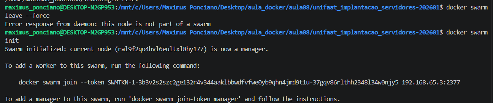
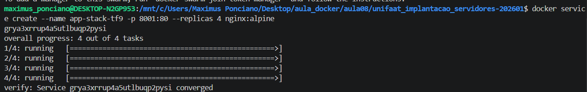
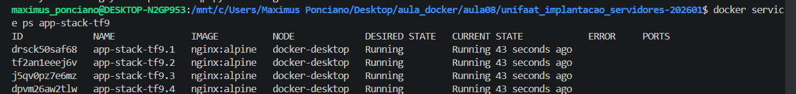
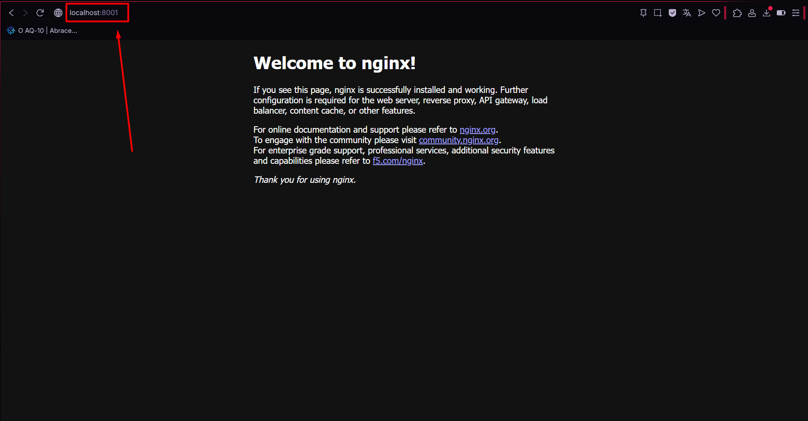
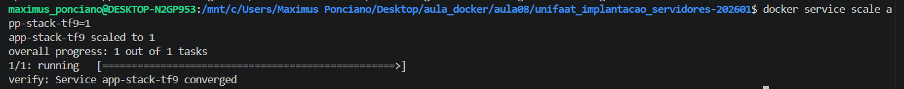
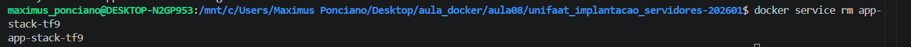
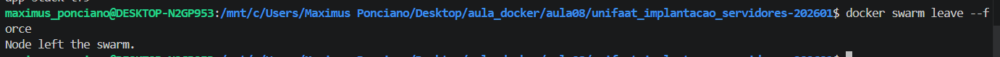

## Respostas Teóricas e Práticas

**Questão 1:** A diferença fundamental é que o **Docker Compose** gerencia stacks em um **único Host**, enquanto o **Docker Swarm** gerencia a stack em um **Cluster** de múltiplos nós, oferecendo alta disponibilidade e balanceamento de carga.

**Questão 2:** O **Manager** gerencia o estado do cluster e escala as tarefas, enquanto o **Worker** apenas executa as tarefas (containers) recebidas do Manager.

**Questão 3:**
a) O comando para inicializar é `docker swarm init`.
b) O Driver de Rede padrão é o **Overlay**.

**Questão 4:**
a) O comando é: `docker service create --name web-escalavel --replicas 3 nginx:alpine`.
b) O comando para status é: `docker service ps web-escalavel`.

**Questão 5:**
a) O comando é: `docker service scale web-escalavel=5`.
b) O termo é **Self-healing** (Auto-recuperação).

## Execução Prática Integrada e Evidências
## Tarefa Prática Integrada (Evidências)

### Passo 1: Inicialização do Cluster
Comandos executados para limpar o ambiente e inicializar o Manager.
```bash
docker swarm leave --force
docker swarm init
```



### Passo 2: Deploy de um Serviço
Criação do serviço app-stack-tf9 com 4 réplicas na porta 8001.
```bash
docker service create --name app-stack-tf9 -p 8001:80 --replicas 4 nginx:alpine
```


### Passo 3: Validação e Evidências
Comando para listar as 4 réplicas e teste de conectividade.
```bash
docker service ps app-stack-tf9
```


Acesso externo no:
```bash
curl localhost:8001
```


### Passo 4: Escalabilidade
Reduzindo o serviço de 4 réplicas para apenas 1.
```bash
docker service scale app-stack-tf9=1
```


### Passo 5: Limpeza Final
Removendo o serviço e saindo do cluster.
Comando para removere.
```bash
docker service rm app-stack-tf9
```


comando para sair do cluster.

```bash
docker swarm leave --force
```

