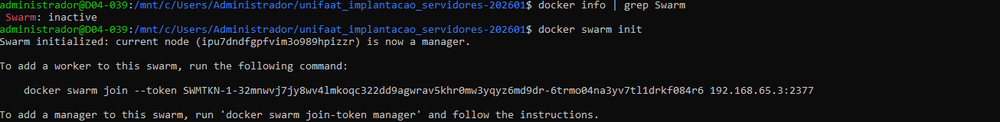
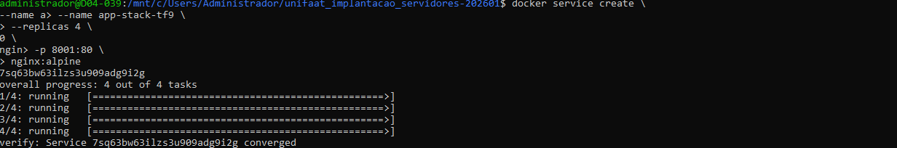
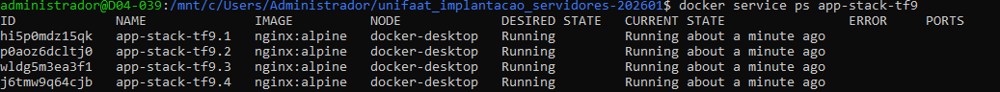
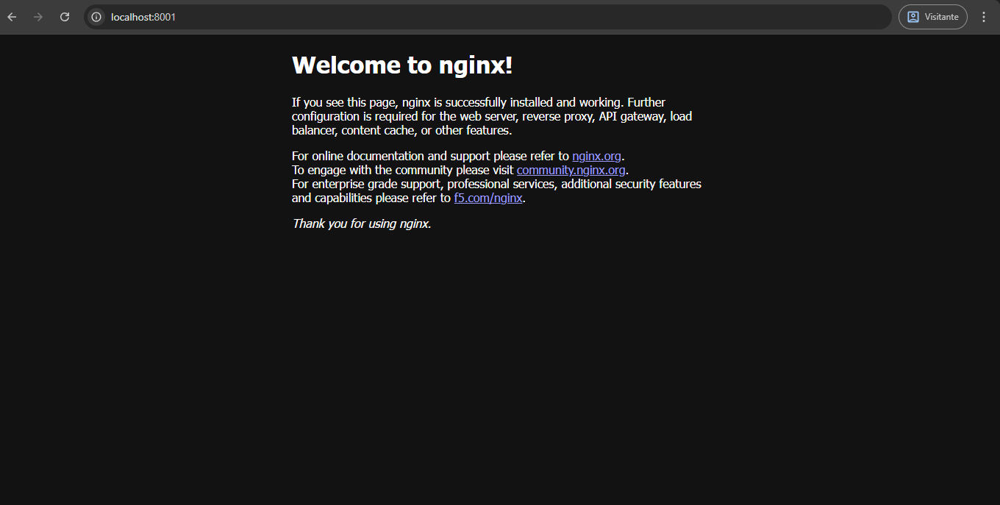
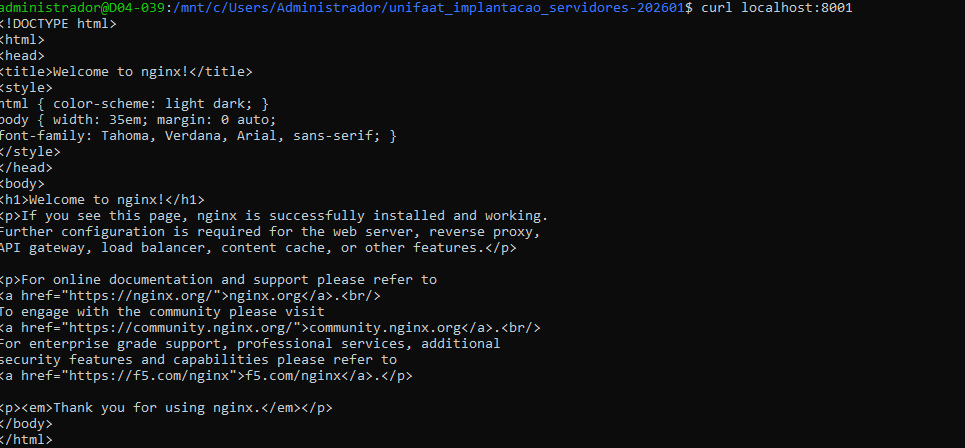
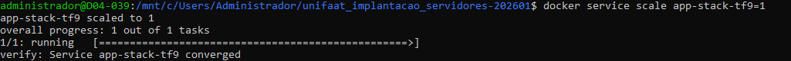
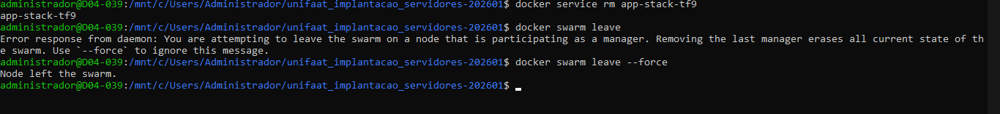

Questão 1:

 O docker compose gerencia um stack em um único host físico ou   virtual, os executa localmente, não suporta distribuição de carga automática de carga ou alta disponibilidade em múltiplos hosts. Já o docker swarm orquestra containers em cluster de hosts, ele distribui serviços replicados e balanceia carga automáticamente entre os nós, oferecendo tolerância e falhas, escalailidade horizontal e gerenciamneto distruído,

 Questão 2:

Tem o manager que é responsável pelo gerenciamento do cluster, incluindo a manutenção do estado, agendamento de tarefas, ciração e atualização de serviços, balanceamento de carga e exposição de APIs para controle. E tem o worker que executa os containers e tarefas atribuídas pelos managers. mão participa do gerenciamento do cluster, focando apenas na execução de workloads. Pode ser promovido a manager se necessário, mas normlamente é dedicado à execução de aplicações.

Questão 3:

A- docker swarm init
B- O overlay

Questão 4:

A- docker service create --name web-escalavel --replicas 3 ngonx:alpine
B- docker service ps web-escalavel

Questão 5:

A- docker service scale web-escalavel=5
B- A capacidade é chamada de auto-recuperação ou "self-healing".

-------------------------PRÁTICA-------------------

Passo 1:

Passo 2:

Passo 3:

Passo 4:

Passo 5:

