## Questão 1: Conceito de Cluster (Teórica)

* Docker Compose gerencia contêineres em um único host, focando na simplicidade e desenvolvimento local. Docker Swarm orquestra contêineres em um cluster de múltiplos nós, oferecendo alta disponibilidade, escalabilidade e balanceamento de carga automático.

## Questão 2: Funções dos Nós (Teórica)

* O Manager gerencia o estado do cluster, realiza orquestração e distribui tarefas. O Worker executa as tarefas atribuídas, como rodar contêineres, sem responsabilidades de gerenciamento.

## Questão 3: Inicialização do Swarm (Prática)

a) **Prática:** Assumindo que você está no seu Host Docker (WSL/Linux), qual comando você deve executar para **inicializar um novo Cluster Swarm**?

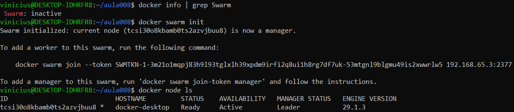

b) Qual é o **Driver de Rede** que o Swarm utiliza por padrão para a comunicação entre *Services* em diferentes Hosts (Nós)?
* O Driver de Rede padrão do Swarm é o overlay, que permite a comunicação segura entre Services em diferentes hosts dentro do cluster.

## Questão 4: Criação de Service (Prática)
O **Service** é o objeto central do Swarm, substituindo o conceito de `docker run` no mundo Compose.

a) **Prática:** Qual comando você deve usar para criar um novo *Service* chamado **`web-escalavel`**, utilizando a imagem `nginx:alpine`, e **escalando**-o para ter 3 réplicas (instâncias) no *Cluster*?

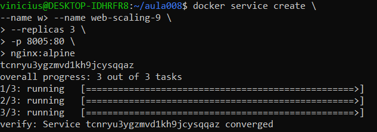

b) Qual comando você deve usar imediatamente após o lançamento para **visualizar o *status* em tempo real** das 3 réplicas do *Service*?

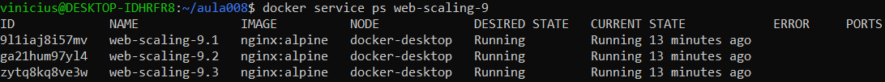

## Questão 5: Atualização e Escalabilidade (Prática)
Você percebe que a aplicação precisa de mais poder de processamento para lidar com picos de tráfego.

a) **Prática:** Qual comando você deve usar para **aumentar** a contagem de réplicas do *Service* `web-escalavel` de 3 para **5**?

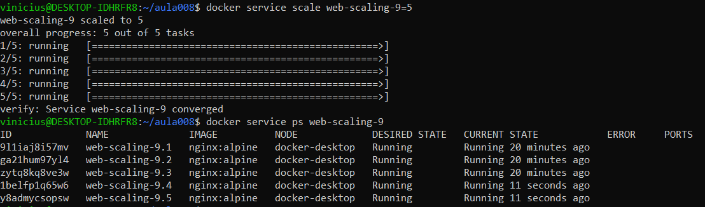

b) **Teórica:** Se um dos nós do *Cluster* falhar, o Swarm tentará realocar automaticamente as instâncias perdidas para outros nós saudáveis. Qual termo descreve essa capacidade do Swarm?

* Essa capacidade do Swarm é chamada de auto-recuperação (self-healing), garantindo que os Services permaneçam disponíveis ao realocar tarefas para nós saudáveis.

## Tarefa Prática Integrada (Obrigatória)
Simule um *Cluster* de nó único, lance um *Service* e prove sua escalabilidade.

### Passo 1: Inicialização do Cluster
1.  **Limpeza:** Certifique-se de que não há nenhum *Cluster* Swarm ativo no seu Host. Se houver, use o comando de limpeza.

2.  **Inicialização:** Inicialize um novo *Cluster* Swarm, tornando seu Host o nó **Manager**.
    *(Liste os comandos de limpeza e inicialização).*

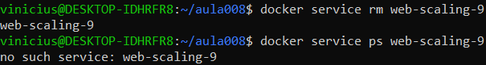

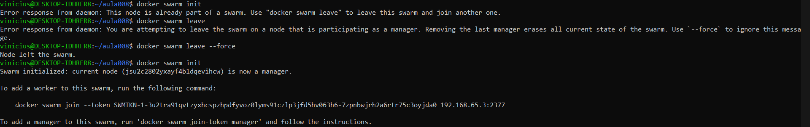

### Passo 2: Deploy de um Serviço
1.  Crie um *Service* chamado **`app-stack-tf9`**, usando a imagem `nginx:alpine`.
2.  Publique a porta **8001** do *Cluster* (Target Port) para a porta 80 do contêiner.
3.  **Escalone** o *Service* para ter 4 réplicas (`--replicas 4`).
    *(Liste o comando `docker service create` completo).*

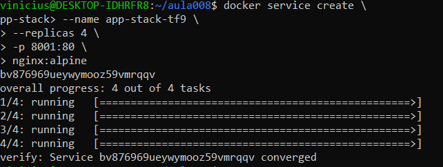

### Passo 3: Validação e Evidências
1.  **Verificação do Status:** Use o comando para visualizar as 4 réplicas do *Service* rodando.
    *(Anexe a saída ou um screenshot desta lista como **Evidência 1**).*

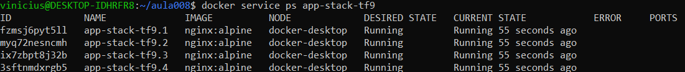

2.  **Acesso Externo:** Use o `curl` (ou o navegador) para acessar a aplicação pela porta mapeada do Host.
    ```bash
    curl localhost:8001
    ```
    *(Anexe a saída do `curl` como **Evidência 2**).*

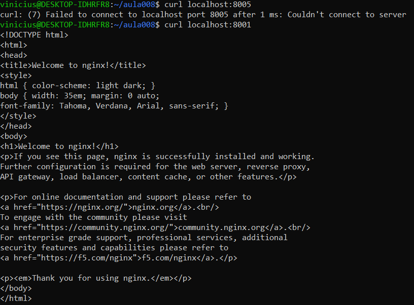

### Passo 4: Escalabilidade
1.  Execute o comando para **diminuir** o número de réplicas do `app-stack-tf9` de 4 para **1**.
    *(Liste o comando de escalabilidade).*

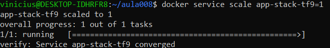

### Passo 5: Limpeza Final
1.  Remova o *Service* `app-stack-tf9`.
2.  Desfaça a inicialização do Swarm (saia do *Cluster*).
    *(Liste os comandos de remoção do Service e o comando de saída do Swarm).*

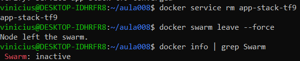