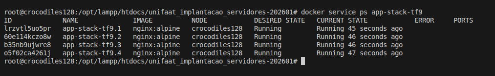
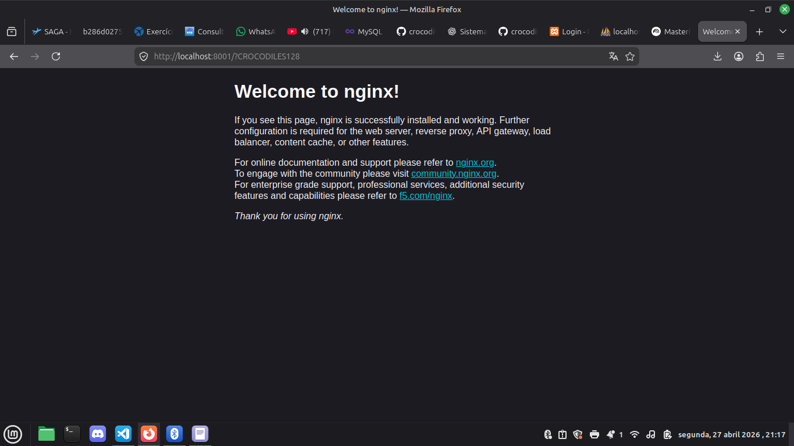

1. Respostas
Questão 1: swarm gerenciar vários hosts e o compose gerenciar varios containers no mesmo host
Questão 2: Fo manager gerencia todos os workers e os workers recebendo a "ordem" domanager, gerenciam os containers

Questão 3: Inicialização do Swarm (Prática)

    iniciar docker swarm: docker swarm init
    passar overlayer dos drivers de rede: rede overlay

    comando para criar: docker service create --name web-escalavel --replicas 3 nginx:alpine
    comando para ver o status: docker service ps web-escalavel

    comando para escalar (escala 5): docker service scale web-escalavel=5
    o nome é: Autorrecuperação ou Self-healing

2. Tarefa Prática Integrada (Evidências)

docker swarm leave --force

docker swarm init

docker service create --name app-stack-tf9 --publish 8001:80 --replicas 4 nginx:alpine

listagem do status:

curl localhost:8001

Saída: 

Comando para reduzir para 1 réplica:

docker service scale app-stack-tf9=1

Comando para apagar o serviço:

docker service rm app-stack-tf9

comando para sair do swarm

docker swarm leave --force

