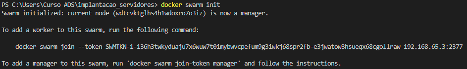
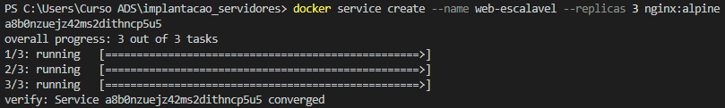
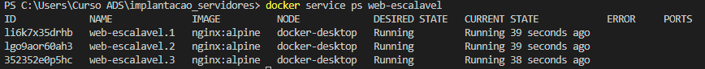
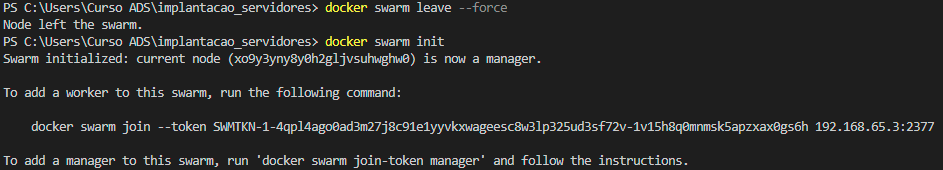
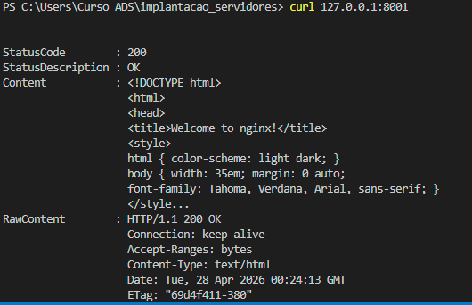
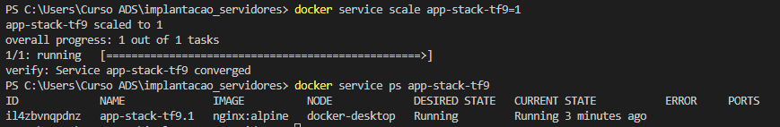
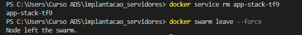

R. Teoricas:

1- a diferença fundamental é escopo e capacidade de orquestração:
o Docker Compose funciona em um único host (máquina). Ele serve para definir e rodar vários containers juntos (um “stack”), mas tudo fica naquela mesma máquina. É mais simples, ideal para desenvolvimento e testes.

já o Docker Swarm funciona em um cluster de várias máquinas. Ele distribui os containers entre diferentes hosts, faz balanceamento de carga, replica serviços e mantém tudo rodando mesmo se algum nó falhar. É mais robusto, usado em produção.

ou seja: 
compose = gerencia containers em 1 máquina
swarm = gerencia containers em várias máquinas (cluster)

2- Dentro de um cluster do Docker Swarm, os nós têm papéis diferentes:
manager (gerente) é o “cérebro” do cluster. Ele decide onde cada container vai rodar, mantém o estado desejado dos serviços (quantas réplicas devem existir), gerencia o cluster e distribui tarefas para os outros nós. Também cuida de coisas como eleição de líder e consistência do estado.

worker (trabalhador) é quem executa as tarefas na prática. Ele recebe instruções dos managers e roda os containers atribuídos, reportando o status de volta.
manager = planeja, coordena e decide
worker = executa os containers

3) a-
b-o driver de rede padrão usado para comunicação entre services em diferentes nós é o Overlay Network Driver. ele permite que containers em máquinas diferentes se comuniquem como se estivessem na mesma rede.

4) a-
b-

5- Passo 1 e 2:

Passo 3:

Passo 4:

Passo 5: Limpeza Final
