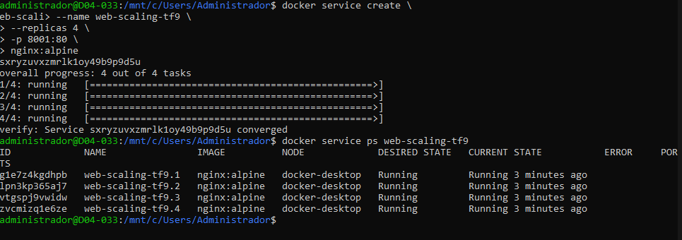
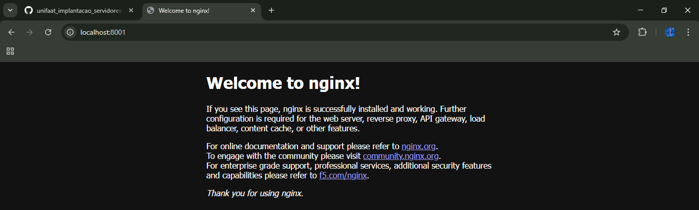

Questão 1: Conceito de Cluster (Teórica)
Qual é a diferença fundamental entre um ambiente Docker rodando com Docker Compose (que gerencia o Stack em um único Host) e um ambiente orquestrado com Docker Swarm (que gerencia o Stack em um Cluster)?
R: Docker Compose gerencia containers em um único host, sendo mais simples e voltado para desenvolvimento. Já o Docker Swarm gerencia serviços em um cluster de vários hosts, oferecendo distribuição de carga e alta disponibilidade.

Questão 2: Funções dos Nós (Teórica)
Dentro de um Cluster Swarm, existem dois papéis principais: Manager e Worker. Explique brevemente as responsabilidades de cada um desses papéis.
R: Os nós Manager controlam o cluster e tomam decisões, enquanto os nós Worker apenas executam os containers conforme as instruções recebidas.

Questão 3: Inicialização do Swarm (Prática)
a) Prática: Assumindo que você está no seu Host Docker (WSL/Linux), qual comando você deve executar para inicializar um novo Cluster Swarm?
R: docker swarm init

b) Qual é o Driver de Rede que o Swarm utiliza por padrão para a comunicação entre Services em diferentes Hosts (Nós)?
R: overlay

Questão 4: Criação de Service (Prática)
O Service é o objeto central do Swarm, substituindo o conceito de docker run no mundo Compose.

a) Prática: Qual comando você deve usar para criar um novo Service chamado web-escalavel, utilizando a imagem nginx:alpine, e escalando-o para ter 3 réplicas (instâncias) no Cluster? 
R: docker service create --name web --replicas 3 nginx:alpine

b) Qual comando você deve usar imediatamente após o lançamento para visualizar o status em tempo real das 3 réplicas do Service?
R: docker service ps web

Questão 5: Atualização e Escalabilidade (Prática)
Você percebe que a aplicação precisa de mais poder de processamento para lidar com picos de tráfego.

a) Prática: Qual comando você deve usar para aumentar a contagem de réplicas do Service web-escalavel de 3 para 5? 
R: docker service scale web-escalavel=5

b) Teórica: Se um dos nós do Cluster falhar, o Swarm tentará realocar automaticamente as instâncias perdidas para outros nós saudáveis. Qual termo descreve essa capacidade do Swarm?
R:Essa capacidade é chamada de auto-healing (autocura), pois o Swarm recria automaticamente as instâncias em outros nós saudáveis.

Tarefa Prática Integrada (Obrigatória)
Simule um Cluster de nó único, lance um Service e prove sua escalabilidade.

Passo 1: Inicialização do Cluster
Limpeza: Certifique-se de que não há nenhum Cluster Swarm ativo no seu Host. Se houver, use o comando de limpeza.
R: docker swarm leave --force

Inicialização: Inicialize um novo Cluster Swarm, tornando seu Host o nó Manager.
R: docker swarm init

Passo 2: Deploy de um Serviço
Crie um Service chamado app-stack-tf9, usando a imagem nginx:alpine.
Publique a porta 8001 do Cluster (Target Port) para a porta 80 do contêiner.
Escalone o Service para ter 4 réplicas (--replicas 4). (Liste o comando docker service create completo).
R: docker service create \
--name web-scaling-tf9 \
--replicas 4 \
-p 8001:80 \
nginx:alpine

Passo 3: Validação e Evidências
Verificação do Status: Use o comando para visualizar as 4 réplicas do Service rodando. 
R: 
Acesso Externo: Use o curl (ou o navegador) para acessar a aplicação pela porta mapeada do Host.
curl localhost:8001
R: 

Passo 4: Escalabilidade
Execute o comando para diminuir o número de réplicas do app-stack-tf9 de 4 para 1. (Liste o comando de escalabilidade).
R: docker service scale web-scaling-tf9=1

Passo 5: Limpeza Final
Remova o Service app-stack-tf9.
Desfaça a inicialização do Swarm (saia do Cluster). (Liste os comandos de remoção do Service e o comando de saída do Swarm).
R: - docker rm -f [ID_DO_CONTÊINER]
- docker service rm web-scaling-tf9
- docker swarm leave --force
