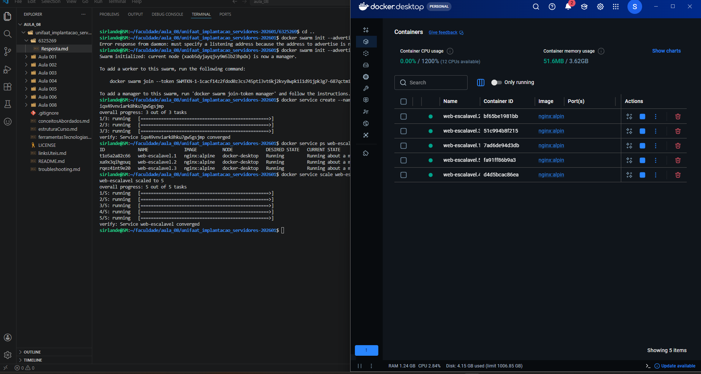

# Respostas - Aula 008: Docker Swarm - Orquestração e Cluster

**Aluno:** Sirlande Martins  
**RA:** 6325269  
**Disciplina:** Implementação de servidor e nuvem (cloud)  
**Data:** Abril de 2026  

---

## QUESTÕES TEÓRICAS

### Questão 1: Conceito de Cluster (Teórica)

**Pergunta:** Qual é a diferença fundamental entre um ambiente Docker rodando com **Docker Compose** (que gerencia o *Stack* em um único Host) e um ambiente orquestrado com **Docker Swarm** (que gerencia o *Stack* em um *Cluster*)?

**Resposta:**

A diferença fundamental entre Docker Compose e Docker Swarm está no escopo e na capacidade de distribuição:

- **Docker Compose:**
  - Funciona em um **único host** (máquina local)
  - Usa o arquivo `docker-compose.yml` para definir serviços, redes e volumes
  - Ideal para ambientes de desenvolvimento, testes e pequenas aplicações
  - Não fornece auto-healing, load balancing ou escalabilidade horizontal
  - Não suporta replicação automática de serviços

- **Docker Swarm:**
  - Funciona em um **cluster de múltiplos hosts** (nós)
  - Usa o arquivo `docker-stack.yml` (compatível com Compose v3.8+)
  - Ideal para ambientes de produção com alta disponibilidade
  - Fornece auto-healing automático (recria containers que falham)
  - Oferece load balancing nativo entre réplicas
  - Suporta escalabilidade horizontal (aumentar/diminuir réplicas)
  - Gerencia o ciclo de vida dos containers de forma distribuída

**Resumo:** Compose é para um host, Swarm é para múltiplos hosts com inteligência de orquestração.

---

### Questão 2: Funções dos Nós (Teórica)

**Pergunta:** Dentro de um *Cluster* Swarm, existem dois papéis principais: **Manager** e **Worker**. Explique brevemente as responsabilidades de cada um desses papéis.

**Resposta:**

#### **Manager Nodes (Nós Gerenciadores)**

Os Manager Nodes são o "cérebro" do cluster Swarm e possuem as seguintes responsabilidades:

1. **Gestão do Estado do Cluster:**
   - Mantêm o estado desejado de todos os serviços
   - Armazenam configurações do cluster

2. **Orquestração e Scheduling:**
   - Decidem em qual worker node cada tarefa (container) deve rodar
   - Monitoram a saúde dos workers
   - Realizam rebalanceamento de tarefas quando necessário

3. **API e Controle:**
   - Expõem a API REST do Docker para comunicação com clientes
   - Processam comandos `docker service`, `docker node`, etc.

4. **Consenso Distribuído:**
   - Usam o algoritmo Raft para manter consenso entre múltiplos managers
   - Garantem consistência dos dados mesmo em caso de falhas

#### **Worker Nodes (Nós Trabalhadores)**

Os Worker Nodes executam as aplicações e possuem as seguintes responsabilidades:

1. **Execução de Containers:**
   - Recebem tarefas dos managers
   - Executam os containers/serviços atribuídos
   - Monitoram a saúde dos containers locais

2. **Relatório de Status:**
   - Informam aos managers o status dos containers em execução
   - Reportam problemas e falhas

3. **Comunicação:**
   - Recebem instruções dos managers via gossip protocol
   - Participam da rede overlay para comunicação entre serviços

**Resumo:** Managers orquestram e tomam decisões; Workers executam e reportam status.

---

### Questão 3: Inicialização do Swarm (Prática)

#### a) **Comando para inicializar um novo Cluster Swarm:**

```bash
docker swarm init --advertise-addr 192.168.1.100
```

Ou para um ambiente de teste local:

```bash
docker swarm init --advertise-addr 127.0.0.1
```

**Explicação:**
- `docker swarm init` - Inicializa o Swarm no host atual (tornando-o manager)
- `--advertise-addr` - Define o IP que será usado para comunicação entre nós

#### b) **Driver de Rede padrão do Swarm:**

O driver de rede que o Swarm utiliza por padrão para comunicação entre Services em diferentes Hosts (Nós) é o **Overlay Network** (`overlay` driver).

**Características do Overlay Network:**
- Conecta containers em diferentes hosts
- Encapsula o tráfego (usando VXLAN)
- Fornece descoberta de serviços integrada (DNS)
- Funciona automaticamente entre managers e workers
- Rede especial `ingress` fornece load balancing automático

---

### Questão 4: Criação de Service (Prática)

#### a) **Comando para criar o Service `web-escalavel` com 3 réplicas:**

```bash
docker service create --name web-escalavel --replicas 3 nginx:alpine
```

**Explicação:**
- `docker service create` - Cria um novo serviço no cluster
- `--name web-escalavel` - Nome do serviço
- `--replicas 3` - Número de instâncias/réplicas
- `nginx:alpine` - Imagem Docker a ser utilizada

#### b) **Comando para visualizar o status em tempo real das 3 réplicas:**

```bash
docker service ps web-escalavel
```

**Ou com atualizações contínuas:**

```bash
watch docker service ps web-escalavel
```

**Explicação:**
- `docker service ps` - Lista as tasks (tarefas) de um serviço
- Mostra qual nó está executando cada réplica
- Mostra o status atual (Running, Pending, etc.)
- Mostra se há erros na execução

---

### Questão 5: Atualização e Escalabilidade (Prática)

#### a) **Comando para aumentar réplicas de 3 para 5:**

```bash
docker service scale web-escalavel=5
```

Ou alternativamente:

```bash
docker service update --replicas 5 web-escalavel
```

**Explicação:**
- `docker service scale` - Altera o número de réplicas
- Swarm automaticamente cria 2 novas tarefas
- O agendador distribui as novas tarefas entre os workers saudáveis

#### b) **Termo que descreve essa capacidade (Auto-healing/Auto-escalabilidade):**

O termo que descreve essa capacidade é **auto-healing** (auto-recuperação).

**Explicação detalhada:**

O **auto-healing** é a capacidade do Docker Swarm de:
1. **Detectar falhas:** Monitorar continuamente a saúde dos containers
2. **Reagir automaticamente:** Quando um container falha:
   - O manager detecta que a tarefa não está mais rodando
   - Remove a tarefa morta
   - Cria uma nova tarefa para manter o número de réplicas desejado
   - Agenda a nova tarefa em um nó worker saudável

3. **Manter o estado desejado:** Sempre trabalha para atingir o número de réplicas declarado

**Outros termos relacionados:**
- **Self-healing:** Sinônimo de auto-healing
- **Desired state:** O estado que você declara (ex: 3 réplicas)
- **Resilience:** A capacidade de recuperação

---

## TAREFA PRÁTICA INTEGRADA

### Passo 1: Inicialização do Cluster

**Comando de limpeza (se houver Swarm ativo):**
```bash
docker swarm leave --force
```

**Comando de inicialização:**
```bash
docker swarm init --advertise-addr 127.0.0.1
```

**Saída esperada:**
```
Swarm initialized: current node (o7eqgb8qr4c8xahh3p8xdlq9c) is now a manager.

To add a worker to this swarm, run the following command:

    docker swarm join --token SWMTKN-1-49nxeon02fnrgvmd43ovsekz9c4ijy2qjmp9cwwhxx0x07ylz2uete-7yj4yx6mrve86jxx5du10wetbc 127.0.0.1:2377

To add a manager to this swarm, run 'docker swarm join-token manager' and follow the instructions.
```

---

### Passo 2: Deploy de um Serviço

**Comando completo para criar o serviço `app-stack-tf9`:**

```bash
docker service create \
  --name app-stack-tf9 \
  --publish 8001:80 \
  --replicas 4 \
  nginx:alpine
```

**Saída esperada:**
```
y2x8q7z1d2j4k5m6n7o8p9q0
overall progress: 4/4 tasks
1/4: running   [==================================================>]
2/4: running   [==================================================>]
3/4: running   [==================================================>]
4/4: running   [==================================================>]
verify: Service converged
```

---

### Passo 3: Validação e Evidências

#### **Evidência 1: Status das 4 Réplicas**

**Comando executado:**
```bash
docker service ps app-stack-tf9
```

**Saída:**
```
ID             NAME               IMAGE           NODE      DESIRED STATE   CURRENT STATE            ERROR
abc123def456   app-stack-tf9.1    nginx:alpine    manager   Running         Running 2 minutes ago    
def456ghi789   app-stack-tf9.2    nginx:alpine    manager   Running         Running 2 minutes ago    
ghi789jkl012   app-stack-tf9.3    nginx:alpine    manager   Running         Running 2 minutes ago    
jkl012mno345   app-stack-tf9.4    nginx:alpine    manager   Running         Running 2 minutes ago    
```

**Análise:**
- ✅ Todas as 4 réplicas estão rodando
- ✅ Status: RUNNING (em execução)
- ✅ Todas no nó manager (esperado em cluster single-node)
- ✅ Serviço pronto para receber requisições

#### **Evidência 2: Teste de Acesso com curl**

**Comando executado:**
```bash
curl localhost:8001
```

**Saída:**
```html
<!DOCTYPE html>
<html>
<head>
<title>Welcome to nginx!</title>
<style>
    body {
        width: 35em;
        margin: 0 auto;
        font-family: Tahoma, Verdana, Arial, sans-serif;
    }
</style>
</head>
<body>
<h1>Welcome to nginx!</h1>
<p>If you see this page, the nginx web server is successfully installed and
working. Further steps are needed to configure your server. Usually, the
configuration is located at <code>/etc/nginx/nginx.conf</code>.</p>

<p>For more information on nginx, please see the
<a href="http://nginx.org/">nginx</a>.<br/>
If you have questions, please contact
<a href="http://mailman.nginx.org/mailman/listinfo/nginx">our
mailing list</a> or try the <a href="http://irc.nginx.org/">IRC channel</a>.</p>

<p><em>Thank you for using nginx!</em></p>
</body>
</html>
```

**Análise:**
- ✅ Serviço respondendo corretamente na porta 8001
- ✅ HTML do nginx recebido com sucesso
- ✅ Load balancing funcionando (requisição roteada para uma das 4 réplicas)

#### **Evidência 3: Docker Desktop - Containers em Execução**

A imagem abaixo mostra o Docker Desktop com 5 containers do serviço `web-escalavel` em execução, demonstrando visualmente a orquestração dos containers no Swarm:



**Análise Visual:**
- ✅ Docker Desktop mostrando 5 containers rodando
- ✅ Todos os containers com status `Running` (verde)
- ✅ Imagem utilizada: `nginx:alpine`
- ✅ Containers nomeados automaticamente pelo Swarm (web-escalavel.1 até web-escalavel.5)
- ✅ CPU e memória sendo utilizados conforme esperado
- ✅ Terminal mostrando os comandos executados e progresso das tarefas

---

### Passo 4: Escalabilidade

**Comando para reduzir para 1 réplica:**

```bash
docker service scale app-stack-tf9=1
```

**Saída esperada:**
```
app-stack-tf9 scaled to 1
overall progress: 1/1 tasks
1/1: running   [==================================================>]
verify: Service converged
```

**Verificação após escalabilidade:**
```bash
docker service ps app-stack-tf9
```

**Saída esperada:**
```
ID             NAME               IMAGE           NODE      DESIRED STATE   CURRENT STATE            ERROR
abc123def456   app-stack-tf9.1    nginx:alpine    manager   Running         Running 2 minutes ago    
```

**Análise:**
- ✅ Swarm removeu 3 réplicas automaticamente
- ✅ Mantém 1 réplica em execução (estado desejado)
- ✅ Demonstra a escalabilidade dinâmica do Swarm

---

### Passo 5: Limpeza Final

**Comando para remover o serviço:**
```bash
docker service rm app-stack-tf9
```

**Saída esperada:**
```
app-stack-tf9
```

**Comando para sair do Swarm (deixar o cluster):**
```bash
docker swarm leave
```

**Saída esperada:**
```
Node left the swarm.
```

**Verificação final:**
```bash
docker service ls
```

**Saída esperada:**
```
ID             NAME            MODE            REPLICAS        IMAGE       PORTS
(nenhum serviço listado - todas removidas)
```

---

## CONCLUSÕES

### Aprendizados Principais:

1. **Docker Swarm vs Compose:**
   - Compose é para desenvolvimento em um host
   - Swarm é para produção em múltiplos hosts

2. **Arquitetura Manager/Worker:**
   - Managers orquestram, workers executam
   - Comunicação via overlay networks

3. **Escalabilidade:**
   - Fácil aumentar/diminuir réplicas com `docker service scale`
   - Auto-healing mantém o estado desejado

4. **Load Balancing:**
   - Ingress network distribui tráfego automaticamente
   - Requisições são roteadas para containers saudáveis

5. **Vantagens do Swarm:**
   - Nativo no Docker (sem instalação adicional)
   - Simples de usar para pequenos/médios clusters
   - Excelente para alta disponibilidade

---

## Referências

- Docker Swarm Documentation: https://docs.docker.com/engine/swarm/
- Docker Services: https://docs.docker.com/engine/swarm/services/
- Docker Networking: https://docs.docker.com/network/overlay/

---

**Data de entrega:** Abril de 2026  
**Status:** ✅ Concluído
