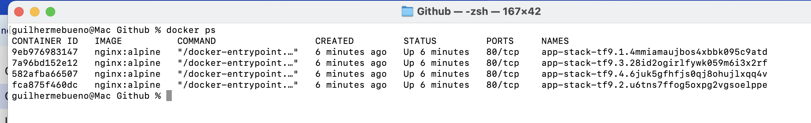
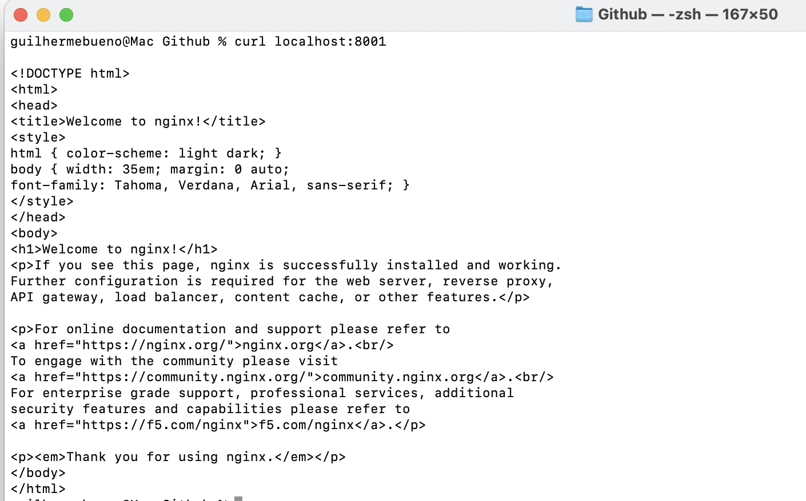

Questão 01: 
 Docker Compose - Utilizado amplamente para criar serviços e componentes que apenas 1 host irá gerenciar, rapido para desenvolver aplicar e fazer deploy. 
 Docker Swarn - Seria interessante para um ambiente onde a aplicaçao já esta rodando, gerenciando os serviços em Cluster, tendo o Maestro de toda a solucao de varios replicar do serviço rodando, pronto para receber a quantidade de demandas que o Maestro neste caso irá distribuir. 

Questão 02: 
Manager: é o orquestrador de toda as replicaçoes rodando, imagine que existe 5 containers prontos, e esta recebendo serviços ele vai encaminhar para os Workers. 
Workers: é o resposavel por receber a demanda de Manager e executar a tarefa. 

Questão 03: 
A: 
Para a criaçao de um novo swarm o comando utilizado é: 
docker swarm init

B: 
Ele criará uma rede Overlay, gerenciada pelo proprio Swarm, fazendo com que ele mesmo faça a distribuiçao dos demais serviços provisionados dentro desse "container". 

Questão 04: 
A: 
Será utilizado o comando : docker service create --name [nome] --replicas [quantidade] -p [porta] [imagem]

Exemplo do exercicio: 
docker service create --name web-escalavel --replicas 3 -p 80:80 nginx:alpine

B: 
O comando utilizado para visualizar os swarn é:
docker service ps web-escalavel

Questão 05: 
docker service create --name web-escalavel --replicas 3 -p 80:80 nginx:alpine
em [--replicars] altera a quantidade para 5.

B: 
É exatamente a inteligencia que o Swarm possui, ele observa os nós criados e caso tenha alguma inconsistencia ou nós quebrados ele vai lá exclui a maquina e sobe novamente para evitar problemas e manter estavel a quantidade de replicaçoes que foi criada. 

## Tarefa Prática Integrada (Obrigatória)

Passo 2: Deploy de um Serviço

Evidencia 1: 

Evidência 2

Passo 04 - Escalabilidade: 
docker service create --name app-stack-tf9 --replicas 1 -p 8001:80 nginx:alpine

Passo 05: 
1- docker service rm app-stack-tf9                                                
2- docker swarm leave --force

